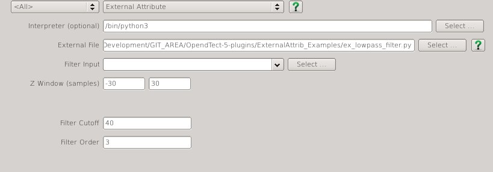

# ExternalAttrib

This is an attribute plugin for the open source seismic interpretation platform <a href="http://www.opendtect.org/" target="_blank">OpendTect</a> - that allows the calculation of single and multitrace attributes outside of OpendTect by a user specified external application. It is currently limited to single attribute input. 

Although still a work in progess it currently works under both Linux and Windows. The source and binary distributions include a reference implementation for writing external attributes in Python/Numpy (version 3).

## Description

Instead of doing the attribute calculation within OpendTect this plugin starts up a user specified external application and then reads and writes the trace data to/from the external application's stdin and stdout. The external application must conform to some [simple rules](#Structure_of_a_Conforming_Application) but could be written in any programming language, compiled or interpreted. This essentially means you can write a new OpendTect attribute in your computer language of choice and not have to delve into the internals of OpendTect.

The source and binary distributions of the plugin includes a reference implementation for writing external attributes in Python/Numpy (version 3). This consists of a module *extattrib.py* that handles the stdin/stdout details and presents the trace data as a numpy array. Two examples using this module are included in the plugin distribution and shown in full below. More examples can be found at [gist.github.com](https://gist.github.com/search?q=OpendTect+External+Attribute).

### Recursive Lowpass Filter (ex_lowpass_filter.py)
This example implements a Butterworth Lowpass filter using Python/Numpy/SciPy.  This is an example of an attribute with single trace input and output.

**NOTE:** the *extattrib.py* module must either be in the same folder as the attribute *.py* file or on the Python module search path.

```python
#
# Simple Butterworth LowPass Filter using Numpy/Scipy
# for the OpendTect ExternalAttrib plugin
#
import sys
import numpy as np
import scipy.signal as sig
#
# Import the module with the I/O scaffolding of the External Attribute
#
import extattrib as xa

#
# Set the attribute parameters
#
xa.params = {
	'Input': 'Filter Input',
	'ZSampMargin' : {'Value': [-30,30]},
	'Par_0' : {'Name': 'Filter Cutoff', 'Value': 40},
	'Par_1' : {'Name': 'Filter Order', 'Value': 3},
    'Help'  : 'https://gist.github.com/waynegm/ed83d99c088db5cb37a9'
}
#
# Define the compute function
#
def doCompute():
#	global Output
	order = xa.params['Par_1']['Value']
	nyquist = 1.0/(2.0*xa.SI['zstep'])
	cutoff = xa.params['Par_0']['Value']/nyquist
	b, a = sig.butter(order, cutoff, 'low', analog=False)
	while True:
		xa.doInput()
		xa.Output = sig.filtfilt(b, a, xa.Input[0,0,:], padtype=None, padlen=0)
		xa.doOutput()

#
# Assign the compute function to the attribute
#
xa.doCompute = doCompute
#
# Do it
#
xa.run(sys.argv[1:])
```
### Prewitt Gradient Filter (ex_prewitt_filter.py)
This is a simple example of using Python/Numpy/SciPy and the External Attribute plugin to define a multi-trace attribute that generates multi-attribute output. This attribute replicates a significant portion of the functionality of the native OpendTect Convolve attribute.

This attribute has the flexibility to output any of the calculated parameters (in-line, cross-line, Z and average gradient) to a display element on the tree or to write one or more outputs to a file. This flexibility comes with the penalty that all attributes are calculated regardless of if they are required or not. If the independent components (in-line, cross-line and Z gradient) were being used separately it would be best to split these out into separate attributes for improved performance.

**NOTE:** the *extattrib.py* module must either be in the same folder as the attribute *.py* file or on the Python module search path.

```python
#
# Apply Prewitt filter
#
import sys
import numpy as np
from scipy.ndimage import prewitt
#
# Import the module with the I/O scaffolding of the External Attribute
#
import extattrib as xa

#
# These are the attribute parameters
#
xa.params = {
	'Input': 'Input',
	'Output': ['Average gradient', 'In-line gradient', 'Cross-line gradient', 'Z gradient'],
	'ZSampMargin' : {'Value': [-1,1], 'Hidden': True},
	'StepOut' : {'Value': [1,1], 'Hidden': True},
    'Help'    : 'https://gist.github.com/waynegm/84f323ec4aab3961c23d'
}
#
# Define the compute function
#
def doCompute():
#
# index of current trace position in Input numpy array
#
	ilndx = xa.SI['nrinl']//2
	crldx = xa.SI['nrcrl']//2
	while True:
		xa.doInput()
		xa.Output['In-line gradient'] = prewitt(xa.Input, axis=0)[ilndx,crldx,:]
		xa.Output['Cross-line gradient'] = prewitt(xa.Input, axis=1)[ilndx,crldx,:]
		xa.Output['Z gradient'] = prewitt(xa.Input, axis=2)[ilndx,crldx,:]
		xa.Output['Average gradient'] = (xa.Output['In-line gradient'] 
										+ xa.Output['Cross-line gradient'] 
										+ xa.Output['Z gradient'])/3
		xa.doOutput()
	
#
# Assign the compute function to the attribute
#
xa.doCompute = doCompute
#
# Do it
#
xa.run(sys.argv[1:])
  
```
## Input Parameters

This attribute has 3 required parameters and up to 9 optional parameters determined by the [JSON parameter string](#Attribute_JSON_Parameter_String) provided by the external application:

| NAME             | DESCRIPTION |
|------------------|-------------|
| Interpreter | For external attributes written in a scripted language this field specifies the location of the  interpreter required to run the script, eg /usr/bin/python3{: style="width:70%"} |
| External File    | The external application to be used for attribute calculation. |
| Input | The input attribute to use |
    
	

## Attribute JSON Parameter String
The external application can specify a set of parameters as a JSON object string

| JSON KEYWORD | PARAMETER FORMAT | DESCRIPTON |
|--------------|--------|------------|
| Input        | String | Specifies a label to appear beside the attribute selection UI element{: style="width:50%"} |
| Output       | Array of strings | Each string specifies the name of an attribute output. If not supplied a single output attribute is assumed. |
| ZSampMargin  | Object with a 'Value' *array of 2 numbers)  and optional 'Hidden' (boolean) parameter. | The 'Value' parameter is an array of 2 numbers specifing the desired minimum number of samples above and below the calculation point required for the calculation. If not supplied only a single value will be provided when the attribute is computed on a timeslice or horizon. The 'Hidden' parameter is a boolean which if set to false makes the ZSampMargin parameter read only. (optional) |
| StepOut      | Object with a 'Value' (array of 2 numbers) and optional 'Hidden' (boolean) parameter. | The 'Value' parameter is an array of 2 numbers specifing the block of traces to be used around the current calculation position. If not supplied only a single trace is provided. The 'Hidden' parameter is a boolean which if set to false makes the StepOut parameter read only. (optional) |
| Selection    | Object with a 'Name' (string), 'Values' (array of strings) and 'Select' (number) parameters | Displays a list box labeled 'Name' with options specified in 'Values' and default selection being item number 'Select'. (optional) |
| Par0         | Object with a 'Name' (string) and 'Value' (number) parameter | Displays an entry box labeled 'Name' with default value 'Value' (optional)| 
| Par1         | As above | As above |
| Par2         | As above | As above |
| Par3         | As above | As above |
| Par4         | As above | As above |
| Help         | String | URL pointing to documentation for the external attribute (optional) |

Here is an example parameter string:
```
{
	'Input': 'Test Input',
    'Output': ['Left', 'Right'],
	'ZSampMargin' : {'Value': [-10,10]},
	'StepOut' : {'Value': [1,1], 'Hidden': true},
	'Par_0' : {'Name': 'First Parameter', 'Value' : 100.0},
	'Par_1' : {'Name': 'Second Parameter','Value': 200.0},
    'Help'  : 'https://gist.github.com/waynegm/84f323ec4aab3961c23d'
}
```

## Issues
### OpendTect (Linux) hangs after selecting a Python external attribute in the Attribute Description Editor
This can happen if the Python file has Windows/DOS linebreaks. Use the dos2unix command on the Python file and all should be ok.
### Setting up a Python/Numpy/Scipy environment
On both Linux and Windows it can be a bit of a pain to set up a Python/Numpy/Scipy development stack for Python 3 from scratch. Continuum Analytics provide free Python installers for Linux and Windows in [Anaconda](http://continuum.io/downloads#all). There is also a smaller DIY option called [Miniconda](http://conda.pydata.org/miniconda.html) which allows you to select just the packages you need (the examples only require Python 3, Numpy and Scipy).

## Structure of a Conforming Application
The rules that a comforming application must follow are:

- When invoked with a commandline argument of `-g` the application should write out a  [JSON parameter string](#Attribute_JSON_Parameter_String) to stdout describing the attribute parameters and exit.
- When invoked with a commandline argument of `-c json-parameter-string` the application 
	- should read and parse the contents of `json-parameter-string` to get the attribute parameters
	- read a 24 byte block of binary data from stdin called the SeismicInfo block (described below)
	- start an endless loop that:
		- reads a 16 byte block of binary data from stdin called the TraceInfo block (described below)
		- reads a data block of 4 byte binary floats from stdin that contains the seismic trace data. The size of the data block depends on the content of the SeismicInfo (number of traces) and TraceInfo ( number of samples) blocks
			- `number_of_traces * number_of_samples * 4 bytes`.
		- calculates the attribute output
		- writes a data block of 4 byte binary floats to stdout that contains the attribute output. The size of the output data block depends on the content of the TraceInfo ( number of samples) block and the number of output attributes
			- `number_of_samples * number_of_outputs * 4 bytes`.

### SeismicInfo Block
This block of binary data is written to the applications stdin immediately after it is started with the `-c` argument. It consists of 24 bytes as follows:

| SIZE    | FORMAT  | DESCRIPTION |
|---------|---------|-------------|
| 4 bytes | integer | number of traces in the input data block |
| 4 bytes | integer | number of inline traces in the input data block |
| 4 bytes | integer | number of crossline traces in the input data block |
| 4 bytes | float   | trace sampling interval  (result of OpendTect API call `SI().zstep()`) |
| 4 bytes | float   | distance between inlines (result of OpendTect API call `SI().inlDistance()`) |
| 4 bytes | float   | distance between crosslines (result of OpendTect API call `SI().crlDistance()`) |
| 4 bytes | float   | (result of OpendTect API call `zFactor()`)
| 4 bytes | float   | (result of OpendTect API call `dipFactor()`) |

### TraceInfo Block
This block of binary data is written to the application stdin immediately before each block of trace data. It consists of 16 bytes as follows:

| SIZE    | FORMAT  | DESCRIPTION |
|---------|---------|-------------|
| 4 bytes{: style="width:10%"} | integer | number of samples in each trace within the input data block (OpendTect `nrsamples` parameter) |
| 4 bytes | integer | position of first sample in data trace within entire seismic trace ( OpendTect `z0` parameter) |
| 4 bytes | integer | inline number of current calculation position |
| 4 bytes | integer | crossline number of current calculation position |


