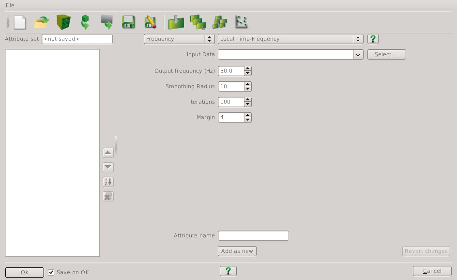

# LTFAttrib

Local time frequency attribute plugin for the open source seismic interpretation platform <a href="http://www.opendtect.org/" target="_blank">OpendTect</a>.

## Description

This is an implementation of the method of local time-frequency analysis described by [Liu, G etal (2011)](http://library.seg.org/doi/abs/10.1190/geo2010-0185.1 "Time-frequency analysis of seismic data using local attributes. Guochang Liu, Sergey Fomel, and Xiaohong Chen. GEOPHYSICS 2011 76:6, P23-P34"). The time-frequency decomposition uses least-squares inversion with shaping regularization. It is different to STFT (short time fourier transform) which divides the data into windows to  localize frequency content in time.

This plugin requires a working installation of <a href="http://www.ahay.org/" target="_blank">Madagascar</a> and provides an example of an attribute using the Madagascar libraries.

This attribute can be unstable. The issue apppears to be in the Madagascar libraries as the same instabilites exist when the equivalent Madagascar command line program (<a href="http://www.reproducibility.org/RSF/sftimefreq.html" target="_blank">sftimefreq</a>) is applied.

## Examples

The output of the LTF attribute (ltf30) is visually identical and also highly correlated to the OpendTect FFT spectral decomposition (sdfreq30) as shown in the following crossplot of the two attributes.

**Crossplot of LTFAttrib vs FFT Spectral Decomposition**

## Input Parameters

This attribute has 4 parameters:

| NAME             | DESCRIPTION |
|------------------|-------------|
| Input Volume     | The attribute volume to be analysed. |
| Frequency        | The frequency component to estimate. |
| Smoothing Radius | In shaping regularization this parameter controls the smoothness of the model. |
| Iterations       | The number of inversion iterations. |
| Margin           | Amount of data around the calculation sample to include in the calculation. Specified in number of smoothing radii. |
    

