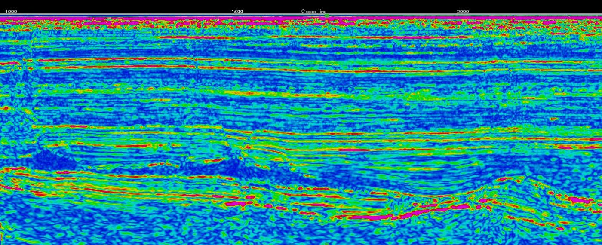
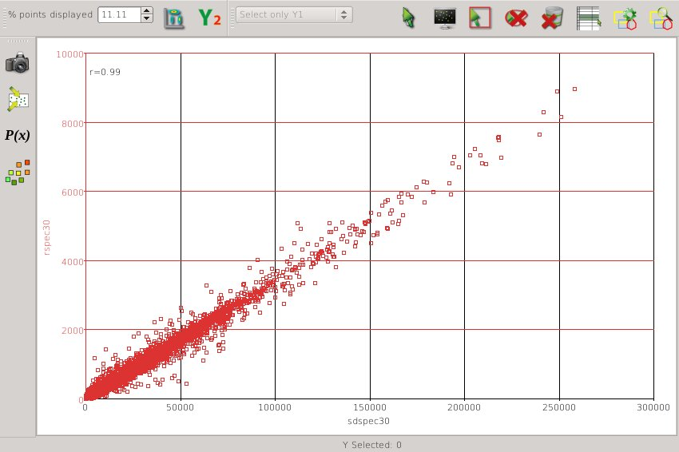
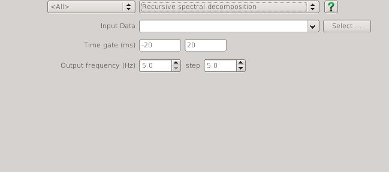

# RSpecAttrib

Recursive time-frequency decomposition attribute for the open source seismic interpretation platform <a href="http://www.opendtect.org/" target="_blank">OpendTect</a>.

## Description

This plugin can be used as an alternative to the <a href="http://opendtect.org/rel/doc/User/base/appendix_spectral-decomposition.htm" target="_blank">OpendTect FFT spectral decomposition attribute</a>.

It does spectral decomposition using [Nilsen's (2007)](https://bora.uib.no/bitstream/handle/1956/3036/42162315.pdf?sequence=1 "Recursive time-frequency reassignment. Geir Kjetil Nilsen. University of Bergen, Norway MSc Thesis") time-frequency analysis algorithm which is a recursive filter approximation to a special case of the short time fourier transform (STFT). 

The primary advantage of this plugin over the standard OpendTect FFT spectral decomposition is that it can be evaluated significantly faster. As an example, under Linux on an Intel Core i5 for a 2000 sample per trace dataset, this attribute can generate a single frequency cube at 4000 traces per second. This is considerably faster than the 140-150 traces per second achieved when applying the OpendTect FFT spectral decomposition attribute. This processing speed advantage is reduced as the number of output frequencies increases but in this test case it still remains substantially faster even for output of up to 30 frequencies.

## Examples

The output of the RSpec attribute (rfreq30) is visually identical and also highly correlated to the OpendTect FFT spectral decomposition (sdfreq30) as shown in the following crossplot of the two attributes.

**Crossplot of RSpecAttrib vs FFT Spectral Decomposition**

## Input Parameters

This attribute has 4 parameters:

| NAME             | DESCRIPTION |
|------------------|-------------|
| Input Volume     | The attribute volume to be analysed.{: style="width:60%"} |
| Time/Depth Gate | This determines the position and time resolution of the analysis. The value from the gate centre is output - useful for analysing a zone offset from an horizon. Recommend setting the gate length equal to or less than the FFT window length you would used for the standard OpendTect FFT spectral decomposition. |
| Output frequency | When displaying the attribute in the tree this is the frequency slice that will be generated |
| Step             | This determines the set of frequencies that can be chosen when generating a frequency volume.|
  

