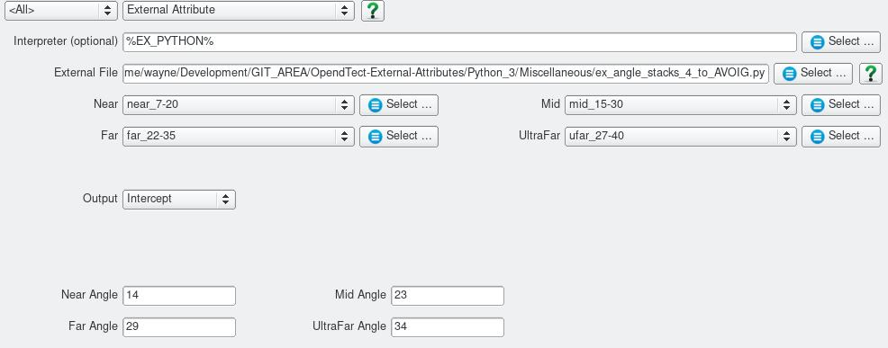

# AVO Intercept and Gradient 
## Description
These [External Attribute](../Attributes/ExternalAttrib) scripts estimate AVO intercept and gradient based on Shuey's 2 term approximation to the Zoeppritz  equation.

## Intercept and Gradient from 4 Angle Stacks
#### Script: Miscellaneous/ex_angle_stacks_4_to_AVOIG.py
Takes as input 4 angle stacks and the corresponding angles and fits a least squares line to the amplitude and $sin^2(angle)$ at each sample point. Ouput includes the intercept, gradient and the correlation coefficient.

### Input Parameters

For each input volume the corresponding incident angle must be provided.

