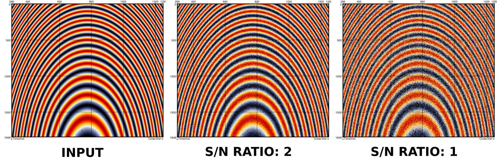
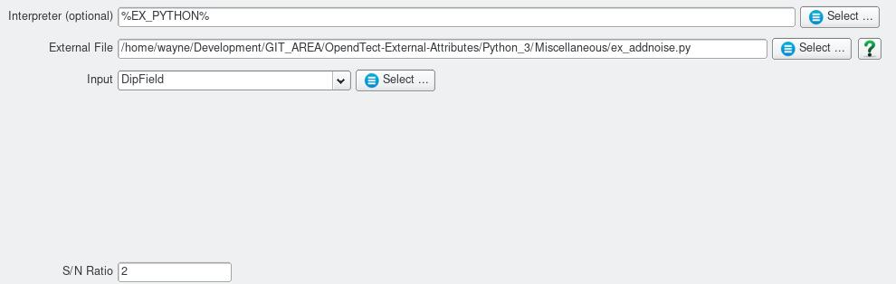

# Add Noise
#### Script: Miscellaneous/ex_add_noise.py
## Description
This Python [External Attribute](../Attributes/ExternalAttrib) script adds gaussian distributed noise to an input signal.

## Examples
This example shows an input signal with different levels of added noise.

## Input Parameters

| NAME             | DESCRIPTION |
|------------------|-------------|
| S/N Ratio        | Desired signal to noise ratio. |

