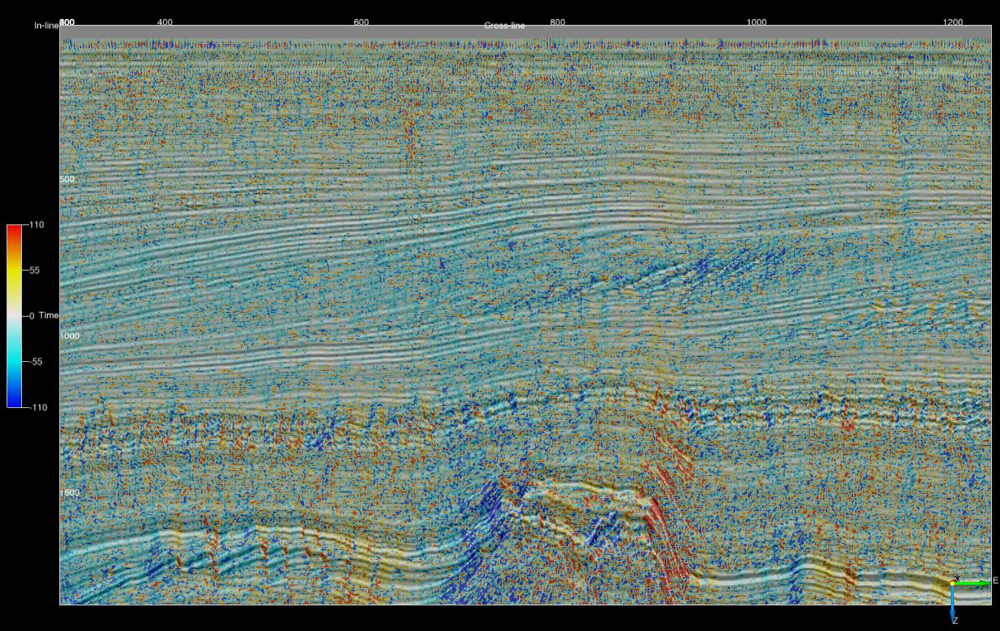
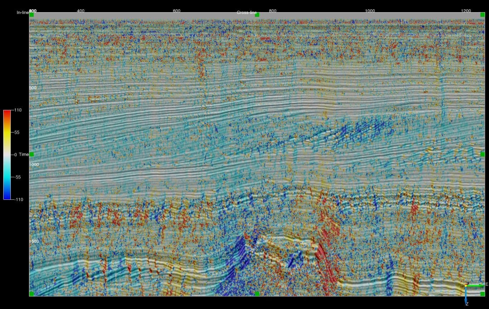
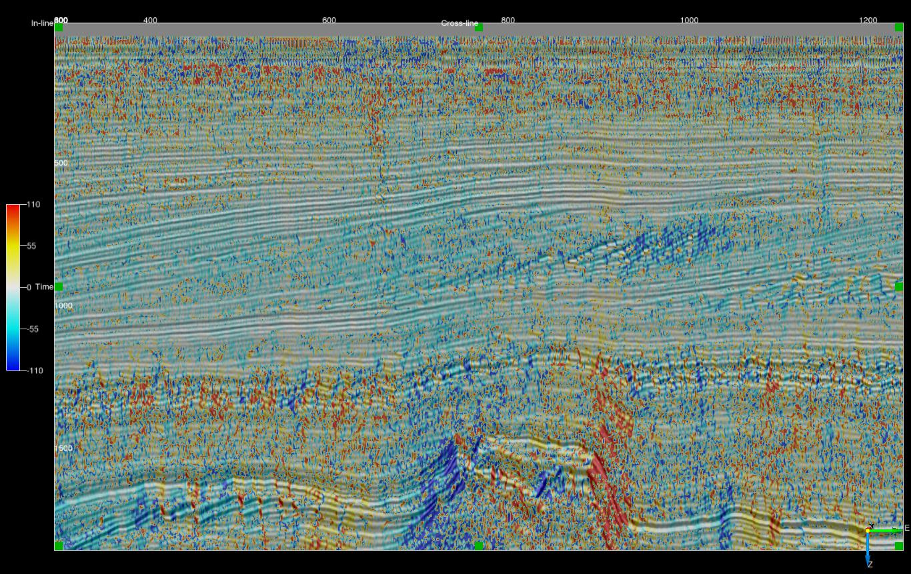
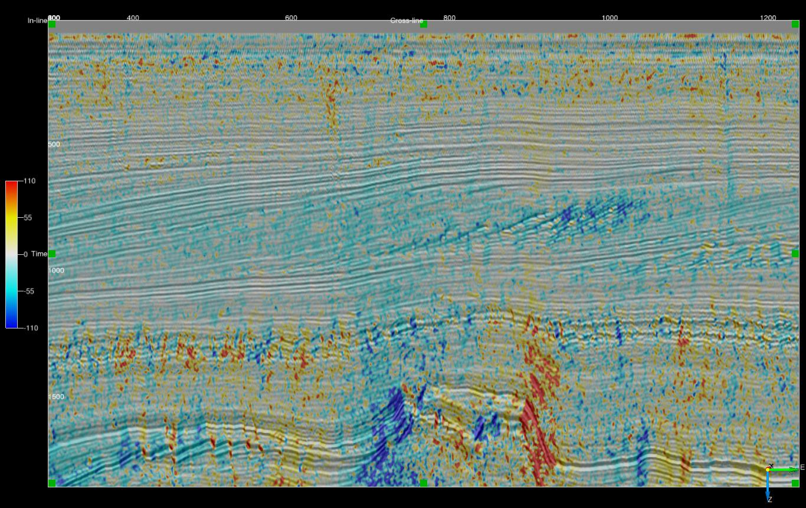
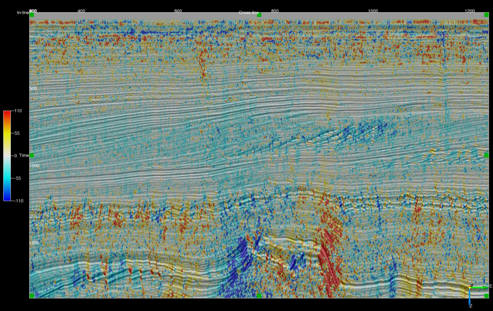

# Dip and Azimuth External Attribute Scripts
## Description
These [External Attribute](../Attributes/ExternalAttrib) scripts estimate orientation, ie dip or dip azimuth, using a variety of techniques.

All scripts will estimate at least the following attributes:

| OUTPUT     | DESCRIPTION
|------------|----------------|
| Inline Dip | Event dip observed on a crossline in microseconds per metre for time surveys and millimetres per metre for depth surveys. Output can be positive or negative with the convention that events dipping towards larger inline numbers producing positive dips. |
| Crossline Dip | Event dip observed on an inline in microseconds per metre for time surveys and millimetres per metre for depth surveys. Output can be positive or negative with the convention that events dipping towards larger crossline numbers producing positive dips. |
| True Dip | Event dip in microseconds per metre for time surveys and millimetres per metre for depth surveys. Output is always positive. |
| Dip Azimuth | Azimuth of the True Dip direction relative to the survey orientation. Output ranges from -180 to 180 degrees. Positive azimuth is defined from the inline in the direction of increasing crossline numbers. Azimuth = 0 indicates that the dip is dipping in the direction of increasing crossline numbers. Azimuth = 90 indicates that the dip is dipping in the direction of increasing inline numbers. |

Some scripts may offer additional outputs such as a measure of event coherency or planarity.

All of the scripts require the numba Python package.

## Orientation from gradients
### Script: ex_gradient_dip.py
Calculates orientation from inline, crossline and Z gradients. No filtering is applied
##### Input Parameters
| NAME             | DESCRIPTION |
|------------------|-------------|
| Output           | What to calculate - choice of inline dip, crossline dip, true dip or dip azimuth. |
##### Example (crossline dip on an inline)

## Orientation from vector filtered gradients
### Script: ex_vf_gradient3_dip.py
Uses [Kroon's (2009)](http://www.k-zone.nl/Kroon_DerivativePaper.pdf "NUMERICAL OPTIMIZATION OF KERNEL BASED IMAGE DERIVATIVES. Dirk-Jan Kroon, University of Twente, Enschede") 3 point derivative filter to estimate data gradients. Next gradient normal unit vectors are determined and smoother using a vector filter.
##### Input Parameters
| NAME             | DESCRIPTION |
|------------------|-------------|
| Output           | What to calculate - choice of inline dip, crossline dip, true dip or dip azimuth. |
| Z window (+/-samples) | Specifies the extent of the analysis cube in the Z direction. Number of Z samples in cube will be 2*Z_window+1. The minimum value is 2.|
| Stepout               | Specifies the inline and crossline extent of the analysis cube. Number of samples in each direction will be 2*Stepout+1. The minimum value for both stepouts is 2. |
| Filter   | Choice of Mean Dip, L1 Vector Median or L2 Vector Median |
The aperture of the vector filtering 2\*Z_window-1 Z samples and 2\*Stepout-1 samples in the inline and crossline direction. For example for a 5x5x5 analysis cube (Z_window=2, Stepout=2) the gradients and associated normal unit vectors are generated on a 3x3x3 cube and vector filtered. The outer samples are only used in the gradient calculation.
##### Example (crossline dip on an inline 5x5x5 input)

## Orientation by the gradient structure tensor
### Scripts: ex_gradient3_st_dip.py & ex_gradient5_st_dip.py
Uses either [Kroon's (2009)](http://www.k-zone.nl/Kroon_DerivativePaper.pdf "NUMERICAL OPTIMIZATION OF KERNEL BASED IMAGE DERIVATIVES. Dirk-Jan Kroon, University of Twente, Enschede") 3 point or Farid's 5 point derivative filter to estimate data gradients which are then used to form the gradient structure tensor.
##### Input Parameters
| NAME             | DESCRIPTION |
|------------------|-------------|
| Output           | What to calculate - choice of inline dip, crossline dip, true dip, dip azimuth or plane coherency. |
| Z window (+/-samples) | Specifies the extent of the analysis cube in the Z direction. Number of Z samples in cube will be 2\*Z_window+1. The minimum value is 2 for gradient3 and 3 for gradient5. |
| Stepout               | Specifies the inline and crossline extent of the analysis cube. Number of samples in each direction will be 2\*Stepout+1. The minimum value for both stepouts is 2 for gradient3 and 3 for gradient5. |
For the gradient3 script the structure tensor is formed from an aperture of 2\*Z_window-1 Z samples and 2\*Stepout-1 samples in the inline and crossline direction.
For the gradient5 script the structure tensor is formed from an aperture of 2\*Z_window-2 Z samples and 2\*Stepout-2 samples in the inline and crossline direction.
##### Example (crossline dip on an inline - gradient3 for 5x5x5 input)

## Orientation from the 3D complex trace phase
### Script: ex_phase3_dip.py
Calculates orientation from the 3D complex trace phase gradients as per [Barnes (2007)](http://library.seg.org/doi/abs/10.1190/1.2785048 "A tutorial on complex seismic trace analysis. Arthur E. Barnes. GEOPHYSICS 2007 72:6, W33-W43"). Kroon's 3 point derivative filter used to compute gradients.
##### Input Parameters
| NAME             | DESCRIPTION |
|------------------|-------------|
| Output           | What to calculate - choice of inline dip, crossline dip, true dip or dip azimuth. |
| Z window (+/-samples) | Specifies the extent of the analysis cube in the Z direction. Number of Z samples in cube will be 2*Z_window+1. The minimum value is 2.|
| Stepout               | Specifies the inline and crossline extent of the analysis cube. Number of samples in each direction will be 2*Stepout+1. The minimum value for both stepouts is 2. |
##### Example (crossline dip on an inline - unfiltered phase dip)

## Orientation from vector filtered 3D complex trace phase
### Script: ex_vf_phase3_dip.py
Calculate orientation unit normal vectors using the 3D complex trace phase gradient and apply a vector filter. [Kroon's (2009)](http://www.k-zone.nl/Kroon_DerivativePaper.pdf "NUMERICAL OPTIMIZATION OF KERNEL BASED IMAGE DERIVATIVES. Dirk-Jan Kroon, University of Twente, Enschede") 3 point filter used to compute gradients.
##### Input Parameters
| NAME             | DESCRIPTION |
|------------------|-------------|
| Output           | What to calculate - choice of inline dip, crossline dip, true dip or dip azimuth. |
| Z window (+/-samples) | Specifies the extent of the analysis cube in the Z direction. Number of Z samples in cube will be 2*Z_window+1. The minimum value is 2.|
| Stepout               | Specifies the inline and crossline extent of the analysis cube. Number of samples in each direction will be 2*Stepout+1. The minimum value for both stepouts is 2. |
| Filter   | Choice of Mean Dip, L1 Vector Median or L2 Vector Median |
The aperture of the vector filtering 2\*Z_window-1 Z samples and 2\*Stepout-1 samples in the inline and crossline direction. 
##### Example (crossline dip on an inline - 5x5x5 input)

## Orientation using the envelope weighted 3D complex trace phase structure tensor
### Script: ex_weighted_phase3_st_dip.py
Forms a structure tensor from the 3D complex trace phase gradients. Tensor elements are weighted by the trace envelope as per [Luo etal (2006)](http://library.seg.org/doi/abs/10.1190/1.2235591?journalCode=gpysa7 "Computation of dips and azimuths with weighted structural tensor approach. Yi Luo, Yuchun Eugene Wang, Nasher M. AlBinHassan and Mohammed N. Alfaraj, GEOPHYSICS 2006 71:5, V119-V121"). [Kroon's (2009)](http://www.k-zone.nl/Kroon_DerivativePaper.pdf "NUMERICAL OPTIMIZATION OF KERNEL BASED IMAGE DERIVATIVES. Dirk-Jan Kroon, University of Twente, Enschede") 3 point filter used to compute gradients. 
##### Input Parameters
| NAME             | DESCRIPTION |
|------------------|-------------|
| Output           | What to calculate - choice of inline dip, crossline dip, true dip or dip azimuth. |
| Z window (+/-samples) | Specifies the extent of the analysis cube in the Z direction. Number of Z samples in cube will be 2*Z_window+1. The minimum value is 2.|
| Stepout               | Specifies the inline and crossline extent of the analysis cube. Number of samples in each direction will be 2*Stepout+1. The minimum value for both stepouts is 2. |
The aperture of the structure tensor is 2\*Z_window-1 Z samples and 2\*Stepout-1 samples in the inline and crossline direction.
##### Example (crossline dip on an inline - 5x5x5 input)
