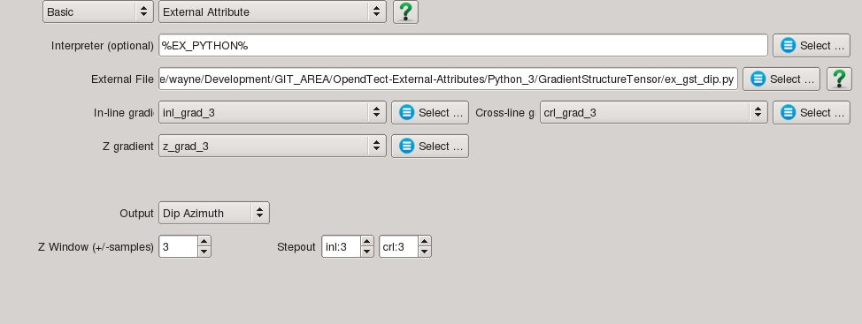

## Description
This external attributes uses the Gradient Structure Tensor to calculate inline  dip, crossline dip, true dip or dip azimuth. The attribute takes as input the inline, crossline and z gradients and is a practical example of an external attribute with multi-trace, multi-attribute input and multi-attribute output.

The attribute requires the scipy and numba Python packages.

Inline, crossline and true dip are given in microseconds per metre for time surveys and millimetres per metre for depth surveys. Inline and crossline dip can be either positive or negative while true dip is always positive.

Dip azimuth is the azimuth in degrees of the true dip direction and ranges from -180 to 180. Positive azimuth is defined from the inline in the direction of increasing crossline numbers. Azimuth = 0 indicates that the dip is dipping in the direction of increasing crossline numbers. Azimuth = 90 indicates that the dip is dipping in the direction of increasing inline numbers. 

## Input Parameters

| NAME             | DESCRIPTION |
|------------------|-------------|
| Output           | What to calculate - choice of inline dip, crossline dip, true dip or dip azimuth. |
| Z window (+/-samples) | Specifies the extent of the analysis cube in the Z direction. Number of Z samples in cube will be 2*Z_window+1. |
| Stepout               | Specifies the inline and crossline extent of the analysis cube. Number of samples in each direction will be 2*Stepout+1. |

Together the Z window and Stepout parameters determine the gaussian weighted spatial averaging applied to the gradients to form the tensor. Generally the Z window and Stepout size should be 3-10 times the size of the operator used to calculate the gradients. For example, if the gradients were calculated using the [Gradient Attribute](../Attributes/GradientAttrib) Kroon 3x3x3 option then Z window and Stepout of 4 to 14 would be appropriate.

## Examples
