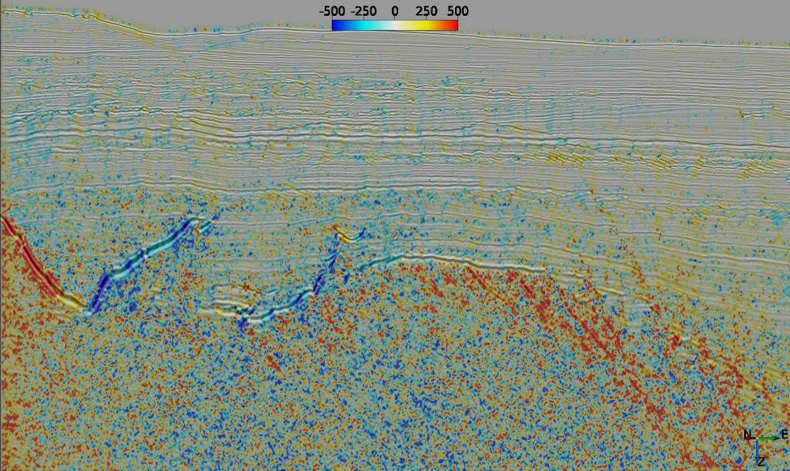

# Local Polynomial Approximation
## Description
This series of External Attributes are based around fitting a second order 3D polynomial to a region of data around each sample location using gaussian weighted least squares. For regularly sampled data the fit can be calculated very efficiently by convolution. 

The approximation has the following form:

$$
	r_0 + r_1*x + r_2*y + r_3*z + r_4*x^2 + r_5*y^2 +r_6*z^2 + r_7*x*y + r_8*x*z + r_9*y*z
$$

where x (inline), y (crossline) and z (time/depth) are relative to the analysis location, ie the analysis location has x=y=z=0.

## Input Parameters
All attributes have the same set of input parameters. The only difference is that some have a choice of output attribute.

| NAME             | DESCRIPTION |
|------------------|-------------|
| Z window (+/-samples) | Specifies the extent of the analysis cube in the Z direction. Number of Z samples in cube will be 2*Z_window+1.{: style="width:60%"} |
| Stepout               | Specifies the inline and crossline extent of the analysis cube. Number of samples in each direction will be 2*Stepout+1. |
| Weight Factor         | Determines the extent of the gaussian weight function used in the weighted least squares approximation.  The standard deviation of the gaussian weight function (__sigma__) is related to this value by  &nbsp;&nbsp;&nbsp;&nbsp;&nbsp;&nbsp;__sigma = min(2\*Stepout, 2\*Z_Window) * Weight_Factor__.  A value of 0.15 gives near zero weight for points at the smallest extent of the analysis cube. |

## LPA Dip 
This attribute (__ex_lpa_dip.py__) uses the local polynomial approximation coefficients to estimate an orientation tensor as per [Farnebäck (2002)](http://dx.doi.org/10.1190/geo2012-0427.1  "Farnebäck, Gunnar. Polynomial Expansion for Orientation and Motion Estimation. Linköping Studies in Science and Technology. Dissertations No, 790") and assumes the orientation of the first eigenvector is normal to the local event dip. Output can be either the inline or crossline dip. The units are millseconds per meter for time data and millimetres per metre for depth data.  Only [Numba JIT compiler](http://numba.pydata.org/) versions of this attribute are provided.

There are two versions of the attribute:

* __ex_lpa_dip_raw.py__ which does not include any post processing of the computed dips. The output will include a lot of steep non-geologic dips whenever an event ends. These spurious dips can generally be removed by applying a median filter (as per the example below).
* __ex_lpa_dip.py__ which includes dip processing comprising removal of dips beyond a user specified limit and a low pass filter along the Z direction.

The example on the left shows inline dip on a crossline from a PSDM volume calculated by __ex_lpa_dip_raw.py__ using a 5x5x5 sample volume (Zwindow: 2, Stepout: 2,2) with a subsequent 3x3x3 sample median filter applied to remove spurious dips. The image on the right shows the output of __ex_lpa_dip.py__ for the same sample volume with a dip range limit of +/-1200 mm/m. 

## LPA Coefficients 
This attribute (__ex_lpa_coef.py__) outputs all of the local polynomial approximation coefficients. The r0 output is identical to the LPA Smoothing attribute. Only a [Numba JIT compiler](http://numba.pydata.org/) version of this attribute is provided. The example below shows the inline first and second derivative components on a crossline.

## LPA Eigenvalues 
This attribute (__ex_lpa_eigenvals.py__) uses the local polynomial approximation coefficients to estimate an orientation tensor as per [Farnebäck (2002)](http://dx.doi.org/10.1190/geo2012-0427.1  "Farnebäck, Gunnar. Polynomial Expansion for Orientation and Motion Estimation. Linköping Studies in Science and Technology. Dissertations No, 790"). Output are the eigenvalues (e1, e2, e3) of the tensor in descending order. Only a [Numba JIT compiler](http://numba.pydata.org/) version of this attribute is provided. The example below shows the first (left image) and second (right image) eigenvalues on a crossline.

## LPA Eigenvectors 
This attribute (__ex_lpa_eigenvec.py__) uses the local polynomial approximation coefficients to estimate an orientation tensor as per [Farnebäck (2002)](http://dx.doi.org/10.1190/geo2012-0427.1  "Farnebäck, Gunnar. Polynomial Expansion for Orientation and Motion Estimation. Linköping Studies in Science and Technology. Dissertations No, 790"). Output are the eigenvectors (t1x,t1y,t1z,t2x,t2y,t2z,t3x,t3y,t3z) of the tensor. Eigenvector [t1x, t1y t1z] corresponds to the first eigenvalue, e1 etc. Only a [Numba JIT compiler](http://numba.pydata.org/) version of this attribute is provided. The example below shows the y-component (left image) and z-component (right image) of the first eigenvector, ie t1y and t1z.

## References
[Anisotropic Multidimensional Savitzky Golay kernels for Smoothing, Differentiation and Reconstruction](http://www.doc.ic.ac.uk/research/technicalreports/2006/DTR06-8.pdf)

[Polynomial Expansion for Orientation and Motion Estimation](http://www.diva-portal.org/smash/get/diva2:302485/FULLTEXT01.pdf)

