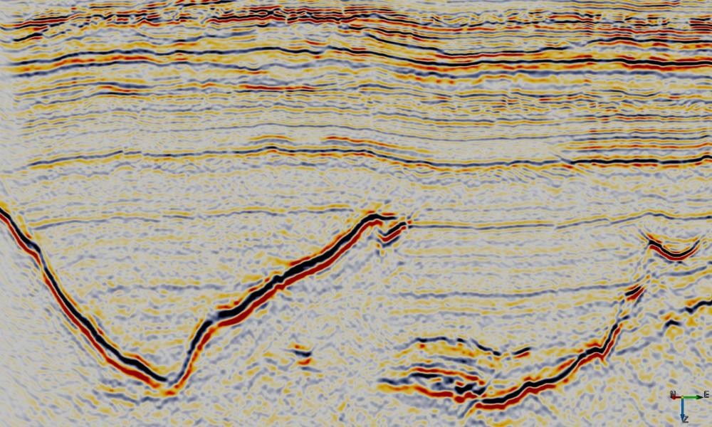

# Local Polynomial Approximation Smoothing
#### Script: ex_lpa_smooth.py
## Description
This [External Attribute](../Attributes/ExternalAttrib) script can be used to apply structure preserving smoothing. A region of data around each sample location is fitted by a second order 3D polynomial using gaussian weighted least squares. 

The approximation has the following form:

	r0 + r1*x + r2*y + r3*z + r4*x^2 + r5*y^2 +r6*z^2 + r7*xy + r8*xz + r9*yz
	
where x (inline), y (crossline) and z (time/depth) are relative to the analysis location, ie the analysis location has x=y=z=0.

This attribute calculates and outputs only the r0 term of the local polynomial approximation. This provides a smoother version of the input with relatively minor smearing of steep dips and fault cuts. Increasing either the Weight Factor or size of the analysis volume (StepOut or Z window) increases the amount of smoothing.

## Examples

## Input Parameters
All attributes have the same set of input parameters. The only difference is that some have a choice of output attribute.

| NAME             | DESCRIPTION |
|------------------|-------------|
| Z window (+/-samples) | Specifies the extent of the analysis cube in the Z direction. Number of Z samples in cube will be 2*Z_window+1.{: style="width:60%"} |
| Stepout               | Specifies the inline and crossline extent of the analysis cube. Number of samples in each direction will be 2*Stepout+1. |
| Weight Factor         | Determines the extent of the gaussian weight function used in the weighted least squares approximation.  The standard deviation of the gaussian weight function (__sigma__) is related to this value by  &nbsp;&nbsp;&nbsp;&nbsp;&nbsp;&nbsp;__sigma = min(2\*Stepout, 2\*Z_Window) * Weight_Factor__.  A value of 0.15 gives near zero weight for points at the smallest extent of the analysis cube. |

# References
[Anisotropic Multidimensional Savitzky Golay kernels for Smoothing, Differentiation and Reconstruction](http://www.doc.ic.ac.uk/research/technicalreports/2006/DTR06-8.pdf)

[Polynomial Expansion for Orientation and Motion Estimation](http://www.diva-portal.org/smash/get/diva2:302485/FULLTEXT01.pdf)

