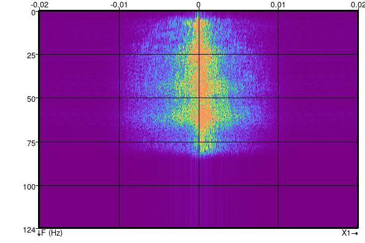

# Spatial Filters
#### Script: Filtering/ex_spatial_filter_circular.py
## Description
This Python [External Attribute](../Attributes/ExternalAttrib) script applies lowpass, highpass, bandpass or band reject circularly symmetric spatial filters. The filters are applied by direct spatial convolution using the MAXFLAT operators presented by [Khan and Ohba (2001)](https://www.researchgate.net/publication/3384111_Explicit_formulae_for_coefficients_of_2D_circular_symmetric_MAXFLATFIR_lowhigh_pass_digital_filters "Explicit formulae for coefficients of 2D circular symmetric MAXFLAT FIR low/high pass digital filters.  Electronics Letters Volume: 37, Issue: 24, 22 Nov 2001").

Note that the filter cutoff or band pass/reject frequency is specified in Normalised Spatial Frequency. Normalised Frequency ranges from 0 to 1 at the spatial nyquist. Converting a spatial frequency in cycles/metre to the equivalent Normalised Spatial Frequency is as simple as dividing it by the spatial nyquist frequency.

As written the filter does not take into account differences in spatial sampling in the inline and crossline directions.

## Examples
This example uses a Low Pass filter to remove acquisition footprint from the F3 Demo dataset.

#### Inline 425: FK Spectrum

Note the noise at 0.0133 cycles/metre or 0.67 normalised frequency (i.e. 0.0133/0.02).

A spatial low pass filter with a normalised frequency cutoff of 0.5 is very effective at attenuating this acquisition footprint.

#### Inline 425

#### Inline 425: FK Spectrum after filter

#### Time Slice 300ms

## Input Parameters

| NAME             | DESCRIPTION |
|------------------|-------------|
| Stepout          | Determines the size of the convolution operator. Minimum of 9 (filter kernel size of 19) recommended |
| Type             | Filter type - Low Pass, High Pass, Band Pass or Band Reject |
| Normalised Spatial Frequency    | For Low Pass and High Pass filters this specifies the filter cutoff. For Band Pass/Reject filters this is the centre of the pass/reject band. The width of the band is hardwired to +/- 0.1 in the script. The filter cutoff corresponds to the half amplitude point.|

