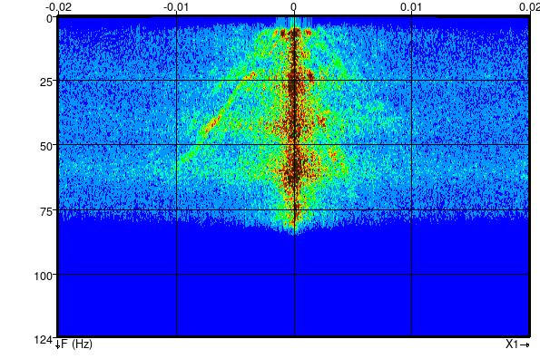
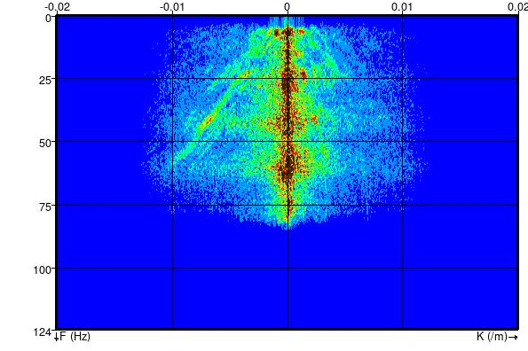

# Spatial Filters - Rectangular Symmetry
#### Script: Filtering/ex_spatial_filter_rectangular.py
## Description
This Python [External Attribute](../Attributes/ExternalAttrib) script applies lowpass, highpass, bandpass or band reject spatial filters with rectangular symmetry. The filters are applied by direct spatial convolution of a kernel formed by cascading two 1D MAXFLAT operators ([Khan and Ohba (2001)](https://www.researchgate.net/publication/3384111_Explicit_formulae_for_coefficients_of_2D_circular_symmetric_MAXFLATFIR_lowhigh_pass_digital_filters "Explicit formulae for coefficients of 2D circular symmetric MAXFLAT FIR low/high pass digital filters.  Electronics Letters Volume: 37, Issue: 24, 22 Nov 2001")).

By setting the stepout in one direction to 0 the filter will be applied as a 1D spatial filter in the other direction.

Note that the filter cutoff or band pass/reject frequency is specified in Normalised Spatial Frequency. Normalised Frequency ranges from 0 to 1 at the spatial nyquist. Converting a spatial frequency in cycles/metre to the equivalent Normalised Spatial Frequency is as simple as dividing it by the spatial nyquist frequency.

## Examples
This example shows inline and crossline FK spectra after applying a 2D lowpass rectangular filter with inline and crossline normalised frequemcy cutoffs of 0.6 and 0.3 respectively.

#### Inline FK Spectrum

#### Crossline FK Spectrum

This example shows a timeslice at 300ms TWT from the F3 Demo dataset after applying a 1D spatial filter along the inlines (stepout of 0,9) with a crossline normalised frequency cutoff of 0.5.
#### Crossline Lowpass Filter

This example shows the timeslice at 300ms TWT from the F3 Demo dataset with the crossline lowpass filter above followed by a 1D spatial filter along the crosslines (stepout 9,0) with an inline normalised rejection frequency of 0.17.
#### Inline Bandreject Filter

## Input Parameters

| NAME             | DESCRIPTION |
|------------------|-------------|
| Stepout          | Determines the size of the convolution operator. Minimum of 9 (filter kernel size of 19) recommended. Setting the stepout to zero will apply a 1D filter, e.g. a stepout of 0,9 will apply a 1D crossline frequency filter  |
| Type             | Filter type - Low Pass, High Pass, Band Pass or Band Reject |
| Normalised Inline Spatial Frequency    | For Low Pass and High Pass filters this specifies the inline filter cutoff. For Band Pass/Reject filters this is the centre of the pass/reject band. The width of the band is hardwired to +/- 0.2 in the script. The filter cutoff corresponds to the half amplitude point.|
| Normalised Xline Spatial Frequency    | For Low Pass and High Pass filters this specifies the crosslineline filter cutoff. For Band Pass/Reject filters this is the centre of the pass/reject band. The width of the band is hardwired to +/- 0.1 in the script. The filter cutoff corresponds to the half amplitude point.|

