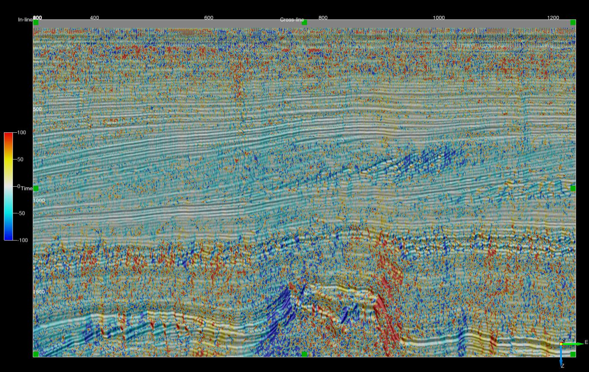

# Vector Filter
#### Script: ex_vector_filter_dip.py
## Description
This [External Attribute](../Attributes/ExternalAttrib) script can be used to apply a vector filter to orientation ( inline and crossline dip) data. The script offers a choice of mean vector, L1 vector median and L2 vector median filters.

The following outputs are available after filtering:

| OUTPUT     | DESCRIPTION
|------------|----------------|
| Inline Dip | Event dip observed on a crossline in microseconds per metre for time surveys and millimetres per metre for depth surveys. Output can be positive or negative with the convention that events dipping towards larger inline numbers producing positive dips. |
| Crossline Dip | Event dip observed on an inline in microseconds per metre for time surveys and millimetres per metre for depth surveys. Output can be positive or negative with the convention that events dipping towards larger crossline numbers producing positive dips. |
| True Dip | Event dip in microseconds per metre for time surveys and millimetres per metre for depth surveys. Output is always positive. |
| Dip Azimuth | Azimuth of the True Dip direction relative to the survey orientation. Output ranges from -180 to 180 degrees. Positive azimuth is defined from the inline in the direction of increasing crossline numbers. Azimuth = 0 indicates that the dip is dipping in the direction of increasing crossline numbers. Azimuth = 90 indicates that the dip is dipping in the direction of increasing inline numbers. |

The script require the numba Python package.

## Examples
Unfiltered phase dip - crossline dip on an inline

Mean vector filtered phase dip - 3x3x3 (Stepout and ZWindow of 1)

L1 vector median filtered phase dip - 3x3x3 (Stepout and ZWindow of 1)

L2 vector median filtered phase dip - 3x3x3 (Stepout and ZWindow of 1)

## Input Parameters

| NAME             | DESCRIPTION |
|------------------|-------------|
| Output           | What to calculate - choice of inline dip, crossline dip, true dip or dip azimuth. |
| Z window (+/-samples) | Specifies the extent of the analysis cube in the Z direction. Number of Z samples in cube will be 2*Z_window+1. |
| Stepout               | Specifies the inline and crossline extent of the analysis cube. Number of samples in each direction will be 2*Stepout+1.|
| Filter   | Choice of Mean Dip, L1 Vector Median or L2 Vector Median |

