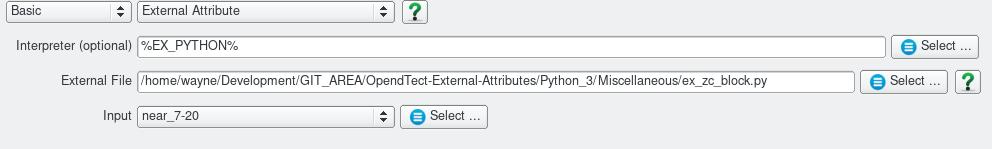

# Zero Crossing Block
#### Script: Miscellaneous/ex_zc_block.py
## Description
This Python [External Attribute](../Attributes/ExternalAttrib) script blocks a seismic trace between zero crossings. The block amplitude is determined by the min/max of the interval blocked.

The script requires the Numba Python package.

## Examples
This example shows the attribute output (blue) over the input (red). The small differences apparent are believed to be due to how OpendTect interpolates between samples.

## Input Parameters

There are no input parameters other than selection of the input volume.

