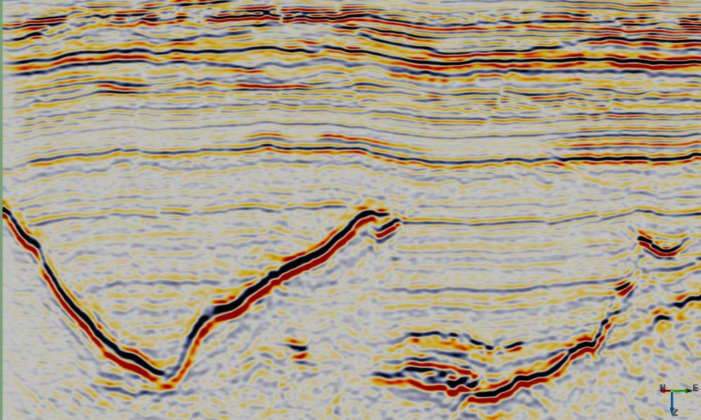




__Script: ex_lpa_smooth.py__

## Description
This Python [../plugins/ExternalAttrib] script can be used to filter noise while preserving steep dips. A region of data around each sample location is approximated by a second order 3D polynomial using gaussian weighted least squares. 

The approximation has the following form:

$$ r_0+ r_1 * x + r_2 * y + r_3 * z + r_4 * x^2 + r_5 * y^2 + r_6 * z^2 +r_7 * x * y + r_8 * x * z + r_9 * y * z $$

where x (inline), y (crossline) and z (time/depth) are relative to the analysis location, ie the analysis location has x=y=z=0.

This attribute calculates and outputs only the $ r_0 $ term of the local polynomial approximation. This provides a smoother version of the input with relatively minor smearing of steep dips and fault cuts. Increasing either the Weight Factor or size of the analysis volume (StepOut or Z window) increases the amount of smoothing.

## Examples

    
    

## Input Parameters

{{ figure('lpa_smooth_inputpar.jpg', 'LPA Smoothing external attribute input parameters') }}

{% set inputtable=[
['NAME','DESCRIPTION'],
['Z window (+/-samples)','Specifies the extent of the analysis cube in the Z direction. Number of Z samples in cube will be $ 2 * Zwindow + 1 $.'],
['Stepout','Specifies the inline and crossline extent of the analysis cube. Number of samples in each direction will be $ 2 * Stepout + 1 $.'],
['Weight Factor','Determines the extent of the gaussian weight function used in the weighted least squares approximation.  The standard deviation of the gaussian weight function ($ \sigma $) is related to this value by

$$ \sigma = min(2*Stepout, 2*Zwindow) * WeightFactor $$

A value of 0.15 gives near zero weight for points at the smallest extent of the analysis cube.']]
%}
{{ table_with_hdr(inputtable,hdrstyle=['col-xs-4','col-xs-8'],style='table-striped table-bordered table-responsive') }}

# References
[Anisotropic Multidimensional Savitzky Golay kernels for Smoothing, Differentiation and Reconstruction](http://www.doc.ic.ac.uk/research/technicalreports/2006/DTR06-8.pdf)

[Polynomial Expansion for Orientation and Motion Estimation](http://www.diva-portal.org/smash/get/diva2:302485/FULLTEXT01.pdf)

