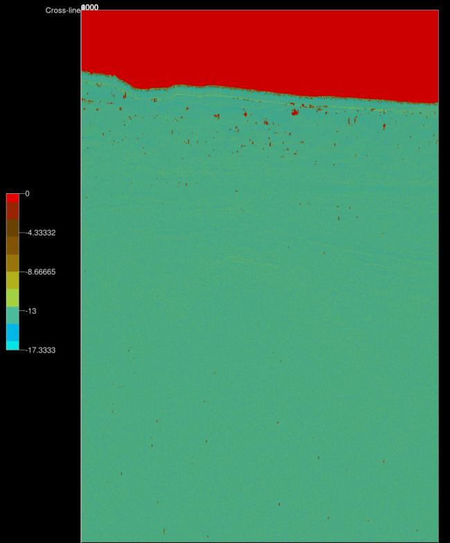
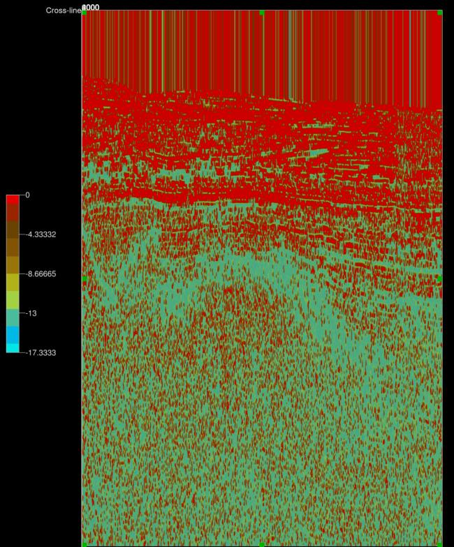




__Script: Miscellaneous/ex_correlation.py__

## Description
This Python [../plugins/ExternalAttrib] script provides an alternative to the builtin OpendTect [Match Delta](http://doc.opendtect.org/6.0.0/doc/od_userdoc/Default.htm#appendix_a-attributes_and_filters/match_delta.htm%3FTocPath%3D11%2520Appendix%2520A%2520-%2520Attributes%2520and%2520Filters%7C_____13) attribute to measure time shifts between similar events in different seismic volumes. This script uses local normalised cross correlation to determine the relative Z shift between 2 data volumes. Aside from the estimate of relative Z shift the attribute can also output the correlation value. The correlation value which ranges from 0 (low correlation) to 1 (high correlation) provides a quantitative assessment of the reliability of the Z shift estimate.

The script requires the Numba Python package.

## Examples
This example provides a comparison of this external attribute script (left) with the Match Delta attribute (right) for a depth section and itself shifted up by 13 metres. The Match Delta attribute output is much noisier albiet it can be calulated much quicker.

    
    

This example shows the Correlation Quality output for the same data as above.

{{ figure('ex_correlation_quality.jpg', 'Correlation quality') }}

## Input Parameters
{{ figure('ex_correlation_input.jpg', 'ex_correlation.py input parameters') }}


{{ table_with_hdr(inputtable,hdrstyle=['col-xs-4','col-xs-8'],style='table-striped table-bordered table-responsive') }}

Note the user has to ensure that Z window is greater than Max Lag otherwise the script will exit with errors.

