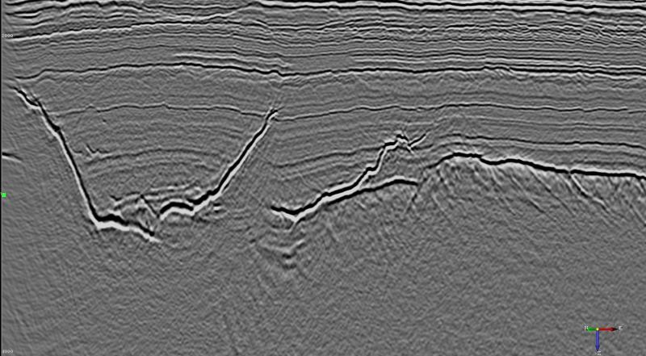
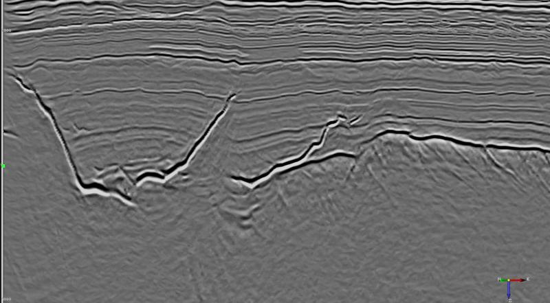




This attribute plugin for the open source seismic interpretation platform [opendtect] applies a structure preserving Mean of Least Variance filter.

## Description

This attribute is an implementation of a mean of least variance filter [Schulze & Pearce (1993)](http://proceedings.spiedigitallibrary.org/proceeding.aspx?articleid=1008684 "Value-and-criterion filters: a new filter structure based on morphological opening and closing. Mark A. Schulze and John A. Pearce. Proc. SPIE 1902, Nonlinear Image Processing IV, 106 (May 21, 1993)") where the analysis elements are all the possible planes through the sample points in the analysis block. This algorithm may be similar to that proposed by [Al-Dossary & Wang (2011)](http://library.seg.org/doi/abs/10.1190/1.3627375 "Structure‐preserving smoothing for 3D seismic attributes. Saleh Al‐Dossary and Yuchun Eugene Wang. SEG Technical Program Expanded Abstracts 2011. January 2011, 1004-1008"). 

The sample variance for all samples on each analysis element is calculated and the output statistic (average, mean or element index) is output for the element with the least variance. 

The following figure shows the relationship between the geometry of the analysis elements and the element index.

{{ figure('MLVFilterAttrib_elements.jpg', 'MLV Filter analysis elements') }}

## Examples

    
    

 

    
    

{{ figure('MLVFilterAttrib_MLV3_Elements.jpg', 'MLV 3 elements') }}

## Input Parameters

This attribute has 2 parameters:
{% set inputtable=[
['NAME','DESCRIPTION'],
['Filter size','Specifies a cube of samples centred  at the analysis location. Increasing the size will increase the degree of smoothing at the risk of smearing structural features. As the examples show it may be better to apply multiple passes of a small size filter than a single pass of a larger filter to reduce the risk of artifacts in the output. OpendTect makes it really easy to cascade multiple filter passes.'],
['Output statistic','What the filter will output. The options are average, median or the element index. The element index is included for curiosity and quality control. Generally the default *Average* provides the most pleasing output.']]
%}
{{ table_with_hdr(inputtable,hdrstyle=['col-xs-4','col-xs-8'],style='table-striped table-bordered table-responsive') }}

{{ figure('MLVFilterAttrib_par1.jpg', 'MLF Filter input parameters') }}

